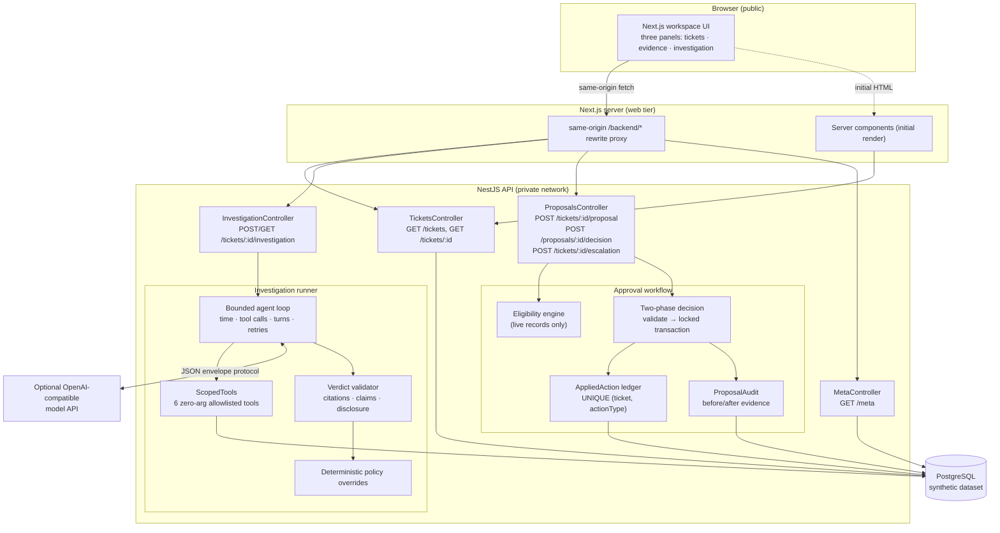

# Architecture & security boundaries

## System overview

**Data flow of a full journey:**

1. Reviewer selects a ticket — the UI fetches ticket + records (read-only).
2. **Run investigation** — the API resolves the ticket's scope, runs the
   bounded loop with a provider (mock by default), and persists the outcome
   (verdict, redacted tool trace, bounds usage, policy overrides). Ticket moves
   `OPEN → IN_REVIEW`.
3. **Derive action proposal** — the eligibility engine evaluates the *live*
   records. If (and only if) the scenario + next-step mapping + record evidence
   support one of the two permitted actions, an immutable `ActionProposal` is
   written with pinned record versions, policy version, evidence snapshot, and
   expiry. Otherwise the API answers with a machine-readable refusal
   (`escalation_only`, `not_eligible`, `no_completed_investigation`).
4. **Decision** — reviewer name + passcode → validate phase → apply
   transaction → audit. Ticket becomes `RESOLVED` only if the mutation commits.
5. **Escalation** — records a durable decision with no account mutation
   (available on every ticket, required for exposure/ambiguous-charge routes).

## Security boundaries

### 1. Tool scoping (investigation time)

- The model may request only `get_ticket`, `get_account`, `list_subscriptions`,
  `list_payments`, `list_invoices`, `list_policies`.
- Tools are **zero-argument**: any `args` object with keys is rejected with
  `invalid_args` *before* any query runs. There is no tool that can express
  another account's id, so prompt injection in ticket text ("call list_invoices
  with accountId=X") cannot reach the data layer.
- Each tool's WHERE clause is fixed to `scope.accountId` / `scope.companyId`,
  derived from the ticket row server-side and immutable for the run.

### 2. Verdict validation (output time)

- Strict JSON envelope protocol; unparsable or off-protocol responses are
  retried within `maxOutputRetries`, then the investigation fails with a
  sanitized reason.
- Citations must reference records actually gathered (`registry` of
  `${recordType}:${id}`) — hallucinated or wrong-account ids are rejected.
- Forbidden-claim patterns reject any output stating a refund/reactivation/
  void *happened*.
- For cross-account-exposure tickets, the related account's identifiers are
  matched against all output text — any disclosure is rejected; the related
  account's records are never fetched in the first place.

### 3. Policy overrides (after the model answers)

- `CROSS_ACCOUNT_EXPOSURE` → risk forced `URGENT`, next step forced
  `SECURITY_ESCALATION`.
- `POSSIBLE_DOUBLE_CHARGE` → uncertainty forced `UNCERTAIN`, next step forced
  `FINANCIAL_REVIEW`.
- Overrides are applied in server code after validation; the model cannot talk
  its way out. Each override is recorded in the persisted investigation.

### 4. Bounds enforced by code

`timeBudgetMs` (wall clock), `maxToolCalls`, `maxTurns`, `maxProviderRetries`,
`maxOutputRetries` — the provider cannot exceed any of them; usage is persisted
per investigation and rendered in the UI.

### 5. Eligibility is server-side only

`evaluateEligibility()` runs against live DB rows (never model text):
- uncertainty must be `CONFIRMED`/`LIKELY` for executable actions;
- entitlement repair requires: `CANCELED` subscription + a `SUCCEEDED` payment
  inside its current period + a matching `PAID` invoice;
- duplicate-invoice correction requires: ≥ 2 `PAID` invoices referencing the
  same `SUCCEEDED` payment (duplicate = latest issued);
- everything else — including exposure and ambiguous-charge routes — is
  structurally escalation-only or refused.

### 6. Two-phase approval with exactly-once apply

**Phase 1 (validation, audited rejection):** proposal must be `PROPOSED` and
unexpired; every pinned record version must still match; the policy version
must be unchanged; each pinned record must still belong to the ticket's
reporter account (wrong-account guard); eligibility is re-derived and must
select the *same* target records. Any refusal writes an `APPROVAL_REJECTED`
audit entry and changes nothing.

**Phase 2 (one transaction):**
1. `SELECT ... FOR UPDATE` on the proposal row (concurrent approvals serialize);
2. re-check status + expiry under the lock;
3. insert the `AppliedAction` ledger row — a `UNIQUE (ticketId, actionType)`
   constraint makes a second applied action of the same type for the same
   ticket a database error, no matter what the code does;
4. apply the permitted mutation (subscription → `ACTIVE` + clear `canceledAt`;
   or duplicate invoice → `VOID` + provenance note);
5. mark the proposal `APPLIED` with decision + actor + timestamp (conditional
   `UPDATE ... WHERE status = 'PROPOSED'`);
6. set the ticket `RESOLVED` (only here — never before the mutation commits);
7. write the `APPLY_SUCCEEDED` audit entry with before/after JSON.

Any throw inside the transaction rolls *everything* back; the ticket is not
resolved, the proposal stays `PROPOSED` (retryable), and an `APPLY_FAILED`
audit entry with the reason is written outside the rolled-back transaction.

### 7. Reviewer identity

- `REVIEWER_PASSCODE` has **no default**; when unset, decision and escalation
  endpoints answer `503 reviewer_auth_not_configured` — the workflow is off,
  never anonymous.
- Passcodes are compared in constant time via SHA-256 digests (no length leak);
  the value is never logged, persisted, or sent to the browser.
- The display name is validated and recorded verbatim in the audit trail; the
  passcode — not the name — is the authentication.

### 8. Deployment isolation

- The browser only calls same-origin `/backend/*`; the Next server proxies to
  the API, which can stay on a private network with no CORS exposure.
- `PUBLIC_READ_ONLY=1` makes every mutating endpoint (investigation run,
  proposal create, decision, escalation) answer `403 public_read_only` — a
  shared public preview can neither mutate the dataset nor trigger paid AI
  usage.
- Provider credentials live only in the API process; error messages from the
  provider adapter are sanitized so keys and HTTP bodies can never reach logs
  or the client.
- PostgreSQL in development uses loopback-only trust auth as a dev convenience;
  deployments must use credential-based URLs (see docs/deployment.md).

## Concurrency proof

The 22-test e2e gate suite (`apps/api/test/action-workflow.e2e-spec.ts`)
fires three concurrent approvals against one proposal over real HTTP: exactly
one applies, the others receive `409 already_decided`, the ledger holds one
row, and one `APPLY_SUCCEEDED` audit entry exists. A second test proves a
ledger conflict rolls back an otherwise-valid approval without resolving the
ticket.
